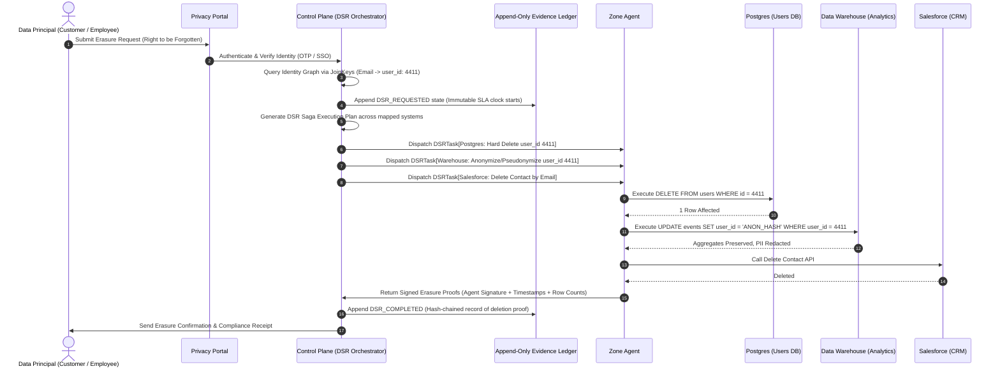
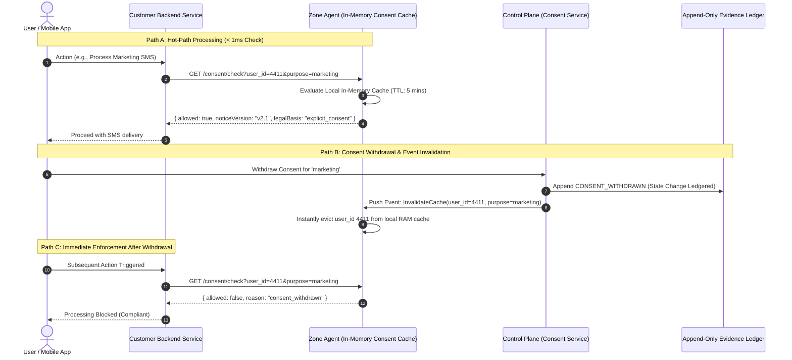

# DPDP Compliance Platform — Master Architecture & Deployment Context

> **Standard**: Digital Personal Data Protection Act (DPDP Act 2025)  
> **Evolution**: `dpdp-cli` (v0.4.2 Static Scanner) $\longrightarrow$ Federated Enterprise Compliance Governance Platform  
> **Target Enterprises**: IT Services Giants (e.g., TCS, Infosys), BFSI (Banks, FinTechs), Healthcare, SaaS, and High-Growth Tech.

---

## 1. Executive Summary & Core Mental Model

The objective of this architecture is to scale a single-codebase static CLI scanner (`dpdp-cli`) into an enterprise-grade, multi-server compliance governance platform.

### The Fundamental Rule
> **"You cannot centralize the data, so you must centralize the *knowledge about* the data."**

* **Local Agents**: Live next to the data (same VPC, Kubernetes cluster, or on-prem datacenter subnet). They scan, classify, and enforce *locally*. **Raw personal data never leaves the customer's network boundary.**
* **Central Control Plane**: Holds only **metadata** (data catalog, consent ledger, policies, audit evidence, compliance score).
* **Communication**: Pure **outbound mTLS 1.3** from agents to the Control Plane (Port 443 only). Zero open inbound firewall ports required.

```
┌────────────────────────────────────────────────────────────────────────┐
│                          CENTRAL CONTROL PLANE                         │
│   (Metadata Only: Data Catalog, Consent Ledger, DPDP Rulepack Engine)  │
└───────────────────────────────────▲────────────────────────────────────┘
                       mTLS Outbound│ (Metadata UP, Tasks DOWN)
┌───────────────────────────────────┴────────────────────────────────────┐
│                    INDEPENDENT AGENT (VPC / Cluster / DMZ)             │
│                                                                        │
│  ┌───────────────────────┐  ┌───────────────────┐  ┌─────────────────┐ │
│  │ Local Secret Resolver │  │ Safe Scrape Engine│  │Disk Event Buffer│ │
│  │ (Vault, K8s, Env)     │  │ (Sample/Throttle) │  │(Crash-Safe JSONL│ │
│  └───────────────────────┘  └───────────────────┘  └─────────────────┘ │
│                                                                        │
│                  DYNAMIC SIGNED WASM CONNECTOR PLUGINS                 │
│     ┌──────────────┬──────────────┬──────────────┬──────────────┐      │
│     │   RDBMS /    │   NoSQL /    │  Microservice│  SaaS / CRM  │      │
│     │   Postgres   │   MongoDB    │  REST/OpenAPI│  Connectors  │      │
│     └──────┬───────┴──────┬───────┴──────┬───────┴──────┬───────┘      │
└────────────┼──────────────┼──────────────┼──────────────┼──────────────┘
             ▼              ▼              ▼              ▼
       [RDS Replica]   [DocumentDB]   [Gateway / DNS] [Salesforce]
```

---

## 2. Key Architectural Invariants

1. **Personal data never rests in the control plane**: Metadata and evidence hashes go up; tasks go down.
2. **Agents dial out. Always**: Outbound mTLS 1.3 over standard port 443. Zero inbound firewall exceptions required.
3. **Credentials stay in the zone**: Control plane knows targets exist, never how to log into them. Credentials are resolved locally via HashiCorp Vault, K8s Secrets, or IAM.
4. **Every compliance state change is ledgered**: Tamper-evident append-only ledger (`row_hash = SHA256(prev_hash || canonical_json(event))`).
5. **DSRs are sagas**: Partial completion across heterogeneous data stores is modeled and logged, never faked.
6. **Policy and rules are versioned data, not code**: Legal updates under DPDP 2025 are rulepack releases, not application redeployments.
7. **Discovery is continuous & drift-aware**: Re-scans diff against previous schema checksums; deep row sampling is skipped if DDL is unchanged.

---

## 3. The 3 Enterprise Deployment Models

The platform is designed around a **Universal Control Plane** codebase that runs identically across all three deployment tiers without code branching:

```
┌────────────────────────────────────────────────────────────────────────────────────────┐
│                        THREE ENTERPRISE DEPLOYMENT STRATEGIES                          │
├─────────────────────────┬──────────────────────────┬───────────────────────────────────┤
│  1. Multi-Tenant SaaS   │   2. Dedicated Cloud     │   3. Self-Hosted / In-VPC         │
│  (AWS Mumbai ap-south-1)│   (Single-Tenant VPC)    │   (Air-Gapped / Private Cloud)    │
├─────────────────────────┼──────────────────────────┼───────────────────────────────────┤
│ • Startups, Mid-Market  │ • Large Enterprises      │ • Tier-1 Banks (BFSI)             │
│ • Postgres RLS isolation│ • Dedicated VPC & DB     │ • TCS / Infosys Private ODCs      │
│ • Setup in <15 minutes  │ • Managed by Platform    │ • Deployed via Helm/Operator      │
│ • Agent in Client VPC   │ • PrivateLink / Peering  │ • 100% Data Sovereignty in DC     │
└─────────────────────────┴──────────────────────────┴───────────────────────────────────┘
```

### Strategy 1: Multi-Tenant SaaS (Managed Cloud in India)
* **Control Plane**: Hosted in AWS Mumbai (`ap-south-1`). Multi-tenancy enforced at the database layer via PostgreSQL **Row-Level Security (RLS)** using tenant session variables (`SET LOCAL app.current_tenant = 'tenant_xyz'`).
* **Customer Estate**: Client runs lightweight Agent(s) inside their VPC/Kubernetes clusters. Outbound mTLS metadata streaming.

### Strategy 2: Dedicated Cloud (Single-Tenant Managed VPC)
* **Control Plane**: An isolated, dedicated single-tenant VPC provisioned in AWS/Azure India exclusively for one customer.
* **Connectivity**: AWS PrivateLink, VPC Peering, or Outbound mTLS. Complete physical and logical compute/database isolation.

### Strategy 3: Self-Hosted / In-VPC / Air-Gapped On-Premises
* **Control Plane & Agents**: 100% deployed inside the customer's own datacenter or private cloud via Helm charts / Kubernetes Operator.
* **Air-Gapped Ready**: Customer manages their own Platform CA, KMS/HSM, and database. Zero internet connectivity required.

---

## 4. Why WebAssembly (WASM) for Agent Plugins

The core agent daemon is a lightweight runtime (<20MB) that dynamically loads **cryptographically signed WASM connector plugins** (`postgres.wasm`, `mongodb.wasm`, `tprm.wasm`).

### The 5 Strategic Advantages:
1. **Sandboxed Memory Safety (Infosec Approval)**: WASM runs in an isolated linear memory sandbox. Connectors cannot access host files, environment variables, or shell commands unless explicitly granted via WASI.
2. **Zero-Downtime Dynamic Delivery**: When an enterprise adds a new database (e.g., Snowflake), the Control Plane streams `snowflake.wasm`. The Agent loads it in-memory without restarting the daemon or updating Helm charts.
3. **Cryptographic Supply-Chain Protection**: Every plugin is digitally signed with the Platform CA. The agent verifies the RSA/ECDSA signature before execution.
4. **Universal Cross-Platform Portability**: Identical `.wasm` bytecode runs on Linux x86, AWS Graviton ARM64, and Windows Server without separate native compilation.
5. **Microsecond Startup & Low Footprint**: Replaces heavy multi-hundred-megabyte Docker sidecars with isolated execution units taking <15MB RAM.

---

## 5. Automated Data Discovery Across Diverse Endpoints

```
┌─────────────────┐     1. Introspect Schema      ┌──────────────────┐
│  Target System  │ ◄───────────────────────────  │   Local Agent    │
│ (e.g., SAP HR)  │                               │                  │
│                 │  ── 2. Safe 200-Row Sample ─► │  PII Classifier  │
│                 │     (Read-Replica Only)       │ (Regex + Verhoeff│
└─────────────────┘                               │    Algorithm)    │
                                                  └─────────┬────────┘
                                                            │ 3. Send Metadata
                                                            ▼
                                                 ┌──────────────────────┐
                                                 │    Control Plane     │
                                                 │     (Data Map)       │
                                                 └──────────────────────┘
```

### Domain Scraping Strategies:
1. **RDBMS / SQL (PostgreSQL, MySQL, Oracle, MS SQL)**:
   * Non-blocking schema catalog queries (`information_schema`, `pg_catalog`).
   * Schema checksum hashing (`SHA256(ddl)`) for drift detection.
   * Statistical sampling ($\le 200$ rows) on **read replicas only** using `TABLESAMPLE BERNOULLI` or `LIMIT` with 3s query timeouts.
2. **Document & NoSQL (MongoDB, DynamoDB, Elasticsearch)**:
   * Probabilistic schema inference over 50 sample documents.
   * Elasticsearch log mapping inspection to catch **PII leaks in logs** (e.g., stack traces with unmasked emails/passwords).
3. **Microservice APIs (REST, OpenAPI, GraphQL)**:
   * Automated Swagger/OpenAPI (`/openapi.json`) and GraphQL introspection (`__schema`).
   * Mapping API parameters to personal data categories and data flow paths.
4. **Source Code Repositories**:
   * Wraps the `dpdp-cli` static analyzer (`ScannerEngine`) to find PII variable references, ORM models, and unmapped database columns.
5. **Cloud Object Stores (S3, GCS, Azure Blob)**:
   * Header and content sniffing on candidate documents (PDF, Word, CSV resumes) locally without transferring documents out of the bucket.

---

## 6. Third-Party Risk Management (TPRM) & Data Flow Correlation

Under DPDP 2025, sharing personal data with sub-processors (payroll agencies, cloud SaaS, background check partners) requires active legal basis and Data Processing Agreements (DPAs).

### How TPRM is Automated:
1. **Intake Register**: Client records third-party vendors, uploaded DPAs, authorized processing purposes, and permitted geographic jurisdictions.
2. **Runtime Traffic & Code Correlation**: The Agent scans API gateway outbound configurations, webhook destinations, and code dependencies.
3. **Violation Flags**: The Control Plane flags:
   * Unmapped third-party data flows (PII sent to undeclared endpoints).
   * Missing or expired DPAs.
   * Cross-border transfers to non-approved foreign jurisdictions.

---

## 7. The ICAP Protocol: Pros, Cons & Use Case

**ICAP (Internet Content Adaptation Protocol - RFC 3507)** is an industry-standard protocol used by enterprise proxies (Zscaler, Squid, F5 BIG-IP, Blue Coat) for content inspection.

```
Employee / App ──► [ Corporate Proxy (Zscaler / F5) ] ──► External Internet
                                │ (ICAP REQMOD / RESPMOD)
                                ▼
                   [ Zone Agent (ICAP Plugin) ] ──► Metadata ──► [ Control Plane ]
```

### Pros:
* **Discovers "Data in Motion"**: Catches live unencrypted PII uploads (e.g. employee uploading a spreadsheet with 5,000 Aadhaar numbers to webmail/Google Drive).
* **Zero App Modification**: Plugs directly into the existing corporate proxy infrastructure.
* **Inline Enforcement**: Can block non-compliant requests (ICAP 204 Block) in real time.

### Cons & Limitations:
* **Requires TLS Interception (MITM)**: Proxy must perform SSL decryption with installed enterprise root certificates.
* **Latency Overhead**: Inspecting multi-megabyte streaming files adds 10–100ms per request.
* **Cannot Map Legacy Data**: Blind to the millions of records resting quietly in databases or warehouses.

**Verdict**: ICAP is an **optional enterprise DLP add-on plugin (`icap-dlp.wasm`)** for large IT services/banking clients with existing proxy fleets, complementing at-rest DB discovery.

---

## 8. Operational Lifecycles & Workflows

### 8.1 Data Subject Rights (DSR) Erasure Saga
When a user exercises their **Right to Erasure** ("Right to be Forgotten"):
1. **Verification**: User identity confirmed via Privacy Portal (OTP/SSO).
2. **Identity Resolution**: Control Plane maps email/phone to internal IDs (`user_id: 4411`) across systems using the Identity Graph.
3. **Distributed Saga Dispatch**:
   * *Postgres Agent*: `DELETE FROM users WHERE id = 4411` (Hard delete).
   * *Warehouse Agent*: `UPDATE events SET user_id = 'ANON_HASH'` (Pseudonymize aggregates).
   * *Salesforce Agent*: Call REST Delete API.
4. **Signed Deletion Proof**: Agents return cryptographic execution receipts; Control Plane ledgers completion proof and closes the statutory SLA clock.



### 8.2 Hot-Path Consent Enforcement & Cache Invalidation
* **Hot Path (<1ms)**: Backend application queries local Agent in-memory cache (`GET /consent/check?user_id=4411&purpose=marketing`).
* **Withdrawal Invalidation**: When a user withdraws consent, Control Plane publishes an invalidation event; Agent immediately purges the user from RAM cache.



---

## 9. Guided 3-Click DPO Approval Wizard

To avoid manual configuration barriers, initial data governance is activated via a 3-click flow:
1. **Click 1: Review Discovered Systems**: Confirm auto-detected databases, microservices, and file stores.
2. **Click 2: Confirm PII & Join Keys**: Validate high-confidence PII tags (Aadhaar, PAN, phone, salary) and cross-system join keys.
3. **Click 3: Accept DPDP Purpose Mappings**: Accept auto-suggested purpose bindings from the standard DPDP template pack (e.g., "Employee Onboarding $\rightarrow$ Aadhaar/Bank Details $\rightarrow$ 5 Year Retention").
* **Result**: Instant generation of the baseline **Enterprise Data Map** and live **DPDP Compliance Score**.

---

## 10. Summary of Architectural Deliverables in Repository

| Asset | Path | Description |
| :--- | :--- | :--- |
| **CLI Core & Analyzers** | [`src/core/scanner/`](file:///C:/Users/Abhishek/Desktop/dpdp-cli/src/core/scanner) | Core discovery pipeline & static regex analysis engine |
| **Storage & Ledger Schema** | [`src/storage/`](file:///C:/Users/Abhishek/Desktop/dpdp-cli/src/storage) | Local storage stores, atomic disk queue & schema migration |
| **VAPT Engine** | [`src/vapt/`](file:///C:/Users/Abhishek/Desktop/dpdp-cli/src/vapt) | Network security & fail-closed passive probing engine |
| **Knowledge Graph** | [`graphify-out/`](file:///C:/Users/Abhishek/Desktop/dpdp-cli/graphify-out) | Interactive HTML graph, community clustering & graph report |
| **Enterprise Master Doc** | [`docs/COMPREHENSIVE_ARCHITECTURE_CONTEXT.md`](file:///C:/Users/Abhishek/Desktop/dpdp-cli/docs/COMPREHENSIVE_ARCHITECTURE_CONTEXT.md) | This master architecture reference |
